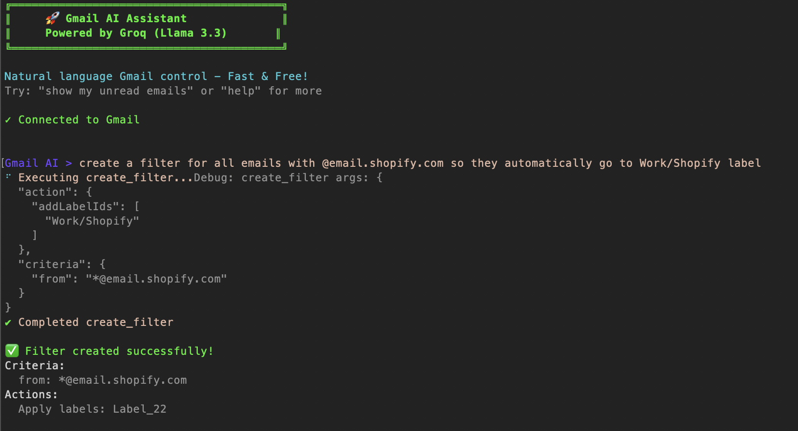

# Gmail Power CLI

**🚧 WIP - Work in Progress**

A command-line interface for Gmail that integrates with AI assistants through Model Context Protocol (MCP) server functionality.

CLI example:


## Features

- Search Gmail messages with natural language queries
- Read email content and metadata
- AI-powered email interactions via Gemini integration
- MCP server for Claude desktop integration

## Setup

1. **Install dependencies:**

   ```bash
   npm install
   ```

2. **Set up Google Cloud Console:**

   - Create project at https://console.cloud.google.com
   - Enable Gmail API
   - Data Access / scopes: gmail.modify
   - Create OAuth 2.0 credentials (Desktop application)
   - Download `credentials.json` to project root

3. **Configure environment variables:**
   Create a `.env` file:

   Currently most success using Groq free tier:

   Get your free API key from: https://console.groq.com/keys

   ```
   GROQ_API_KEY=your-groq-api-key
   ```

4. **Authenticate with Gmail:**
   ```bash
   npm run auth
   ```

## Usage

**CLI Mode:**

```bash
npm run gmail
```

**MCP Server Mode:**

```bash
npm run start
```

**Development:**

```bash
npm run dev
```
